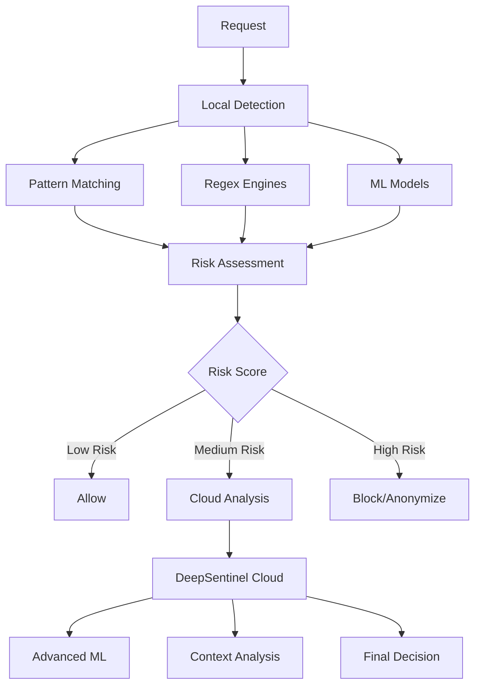

# Compliance & Security

DeepSentinel's compliance engine is designed to detect and prevent sensitive data from being exposed to LLM providers. This section explains how the detection systems work and how to configure them for your needs.

## Compliance Architecture



## Detection Engines

### PII (Personally Identifiable Information) Detection

Detects various types of personal information:

```python
from deepsentinel import PIIDetector

detector = PIIDetector()

# Detected PII types
pii_types = [
    "email_addresses",
    "phone_numbers", 
    "social_security_numbers",
    "credit_card_numbers",
    "passport_numbers",
    "driver_license_numbers",
    "addresses",
    "names",
    "ip_addresses",
    "mac_addresses"
]
```

**Example Detection:**
```python
text = "Contact John Doe at john.doe@example.com or call 555-123-4567"

violations = detector.scan(text)
# Returns: [
#   {"type": "email", "value": "john.doe@example.com", "confidence": 0.95},
#   {"type": "phone", "value": "555-123-4567", "confidence": 0.90}
# ]
```

### PHI (Protected Health Information) Detection

Specialized for healthcare data under HIPAA:

```python
from deepsentinel import PHIDetector

detector = PHIDetector()

# Detected PHI types
phi_types = [
    "medical_record_numbers",
    "insurance_numbers", 
    "prescription_numbers",
    "medical_conditions",
    "treatment_information",
    "lab_results",
    "medication_names",
    "healthcare_provider_names"
]
```

**Example Detection:**
```python
text = "Patient MRN 123456789 has diabetes and takes metformin 500mg"

violations = detector.scan(text)
# Returns: [
#   {"type": "medical_record_number", "value": "123456789", "confidence": 0.98},
#   {"type": "medical_condition", "value": "diabetes", "confidence": 0.85},
#   {"type": "medication", "value": "metformin 500mg", "confidence": 0.90}
# ]
```

### PCI (Payment Card Industry) Detection

Focuses on payment-related sensitive data:

```python
from deepsentinel import PCIDetector

detector = PCIDetector()

# Detected PCI types
pci_types = [
    "credit_card_numbers",
    "debit_card_numbers",
    "cvv_codes",
    "bank_account_numbers",
    "routing_numbers",
    "payment_processor_ids"
]
```

**Example Detection:**
```python
text = "My Visa card number is 4111-1111-1111-1111 with CVV 123"

violations = detector.scan(text)
# Returns: [
#   {"type": "credit_card", "value": "4111-1111-1111-1111", "confidence": 0.99},
#   {"type": "cvv", "value": "123", "confidence": 0.95}
# ]
```

## Compliance Policies

### Creating Policies

Policies define how DeepSentinel should handle different types of sensitive data:

```python
from deepsentinel import CompliancePolicy, PIIPolicy, ContentFilterPolicy

# Basic compliance policy
basic_policy = CompliancePolicy(
    name="basic-compliance",
    jurisdictions=["GDPR", "CCPA"],
    block_on_violation=True,
    max_risk_score=0.8,
    enable_pii_detection=True,
    enable_phi_detection=False,
    enable_pci_detection=True
)

# Specialized PII policy
pii_policy = PIIPolicy(
    name="strict-pii",
    pii_types=["email", "phone", "ssn", "credit_card"],
    anonymization_strategy="mask",
    block_threshold=0.7,
    notify_on_detection=True
)

# Content filtering policy
content_policy = ContentFilterPolicy(
    name="content-filter",
    blocked_categories=["harassment", "hate_speech", "violence"],
    severity_threshold="medium",
    custom_patterns=["company_confidential", "internal_only"]
)
```

### Policy Configuration

Apply policies to your client:

```python
from deepsentinel import SentinelClient

client = SentinelClient(
    sentinel_api_key="your-key",
    openai_api_key="your-openai-key",
    compliance_policies=[basic_policy, pii_policy, content_policy]
)
```

## Risk Assessment

DeepSentinel calculates risk scores for content based on:

### Risk Factors
- **Sensitivity Level**: Type of data detected (SSN = high, email = medium)  
- **Confidence Score**: How certain the detection is
- **Context**: Where the sensitive data appears in the request
- **Quantity**: Amount of sensitive data in a single request
- **Patterns**: Unusual patterns that might indicate data dumps

### Risk Scores
- **0.0 - 0.3**: Low risk - Usually allowed
- **0.4 - 0.7**: Medium risk - May trigger additional analysis
- **0.8 - 1.0**: High risk - Typically blocked or anonymized

```python
# Example risk calculation
text = "Employee SSN: 123-45-6789, Email: employee@company.com"

risk_assessment = {
    "overall_score": 0.85,  # High risk due to SSN
    "factors": [
        {"type": "ssn", "score": 0.95, "confidence": 0.98},
        {"type": "email", "score": 0.3, "confidence": 0.95}
    ],
    "recommendation": "block"
}
```

## Compliance Actions

When violations are detected, DeepSentinel can take several actions:

### Block Request
```python
from deepsentinel import ComplianceViolationError

try:
    response = client.chat.completions.create(
        model="gpt-4o",
        messages=[{"role": "user", "content": "My SSN is 123-45-6789"}]
    )
except ComplianceViolationError as e:
    print(f"Request blocked: {e.message}")
    print(f"Violations: {[v.type for v in e.violations]}")
```

### Anonymize Data
```python
# Original: "Contact John at john@example.com"
# Anonymized: "Contact [NAME] at [EMAIL]"

client = SentinelClient(
    sentinel_api_key="your-key",
    openai_api_key="your-openai-key",
    anonymization_enabled=True
)

# Request is automatically anonymized before sending to provider
response = client.chat.completions.create(
    model="gpt-4o",
    messages=[{"role": "user", "content": "Contact John at john@example.com"}]
)
```

### Log and Continue
```python
# Allow request but log the violation
policy = CompliancePolicy(
    name="log-only",
    block_on_violation=False,  # Don't block
    log_violations=True        # But log them
)
```

## Jurisdiction-Specific Compliance

### GDPR (General Data Protection Regulation)
```python
gdpr_policy = CompliancePolicy(
    name="gdpr-compliance",
    jurisdictions=["GDPR"],
    block_on_violation=True,
    pii_categories=[
        "personal_identifiers",
        "location_data", 
        "online_identifiers",
        "biometric_data"
    ],
    right_to_erasure=True,
    data_minimization=True
)
```

### HIPAA (Health Insurance Portability and Accountability Act)
```python
hipaa_policy = CompliancePolicy(
    name="hipaa-compliance", 
    jurisdictions=["HIPAA"],
    enable_phi_detection=True,
    phi_categories=[
        "medical_records",
        "health_plan_numbers",
        "medical_device_identifiers"
    ],
    minimum_necessary=True,
    audit_logging=True
)
```

### CCPA (California Consumer Privacy Act)
```python
ccpa_policy = CompliancePolicy(
    name="ccpa-compliance",
    jurisdictions=["CCPA"],
    consumer_categories=[
        "personal_identifiers",
        "commercial_information",
        "internet_activity",
        "geolocation_data"
    ],
    opt_out_rights=True,
    transparency_requirements=True
)
```

## Custom Detection Patterns

Add your own detection patterns for organization-specific sensitive data:

```python
from deepsentinel import PatternMatcher

# Define custom patterns
custom_patterns = {
    "employee_id": r"EMP\d{6}",
    "project_code": r"PROJ-[A-Z]{3}-\d{4}",
    "api_key": r"sk-[a-zA-Z0-9]{32}"
}

pattern_matcher = PatternMatcher(custom_patterns)

# Register with compliance engine
client.compliance_engine.add_detector(pattern_matcher)
```

## Performance Optimization

### Local vs Cloud Detection

```python
# Fast local detection for obvious patterns
local_config = {
    "enable_local_detection": True,
    "local_patterns": ["ssn", "credit_card", "email"],
    "cloud_threshold": 0.7  # Only use cloud for medium risk
}

# More thorough but slower cloud analysis
cloud_config = {
    "enable_cloud_analysis": True,
    "cloud_models": ["advanced_pii", "context_analysis"],
    "max_cloud_latency": 200  # ms
}
```

### Caching Detection Results

```python
# Cache compliance decisions to avoid re-analyzing similar content
cache_config = {
    "enable_compliance_cache": True,
    "cache_ttl": 3600,  # 1 hour
    "cache_max_size": 10000,  # entries
    "hash_content": True  # Hash content for privacy
}
```

## Monitoring Compliance Events

### Real-time Monitoring
```python
from deepsentinel import ComplianceMonitor

monitor = ComplianceMonitor(client)

# Set up event handlers
@monitor.on("violation_detected")
def handle_violation(event):
    print(f"Violation: {event.type} - Risk: {event.risk_score}")
    
@monitor.on("policy_triggered") 
def handle_policy(event):
    print(f"Policy '{event.policy}' triggered action: {event.action}")

# Start monitoring
monitor.start()
```

### Compliance Reporting
```python
from deepsentinel import ComplianceReporter

reporter = ComplianceReporter(client)

# Generate compliance report
report = reporter.generate_report(
    start_date="2025-01-01",
    end_date="2025-01-31",
    include_trends=True,
    group_by=["violation_type", "policy"]
)

print(f"Total violations: {report.total_violations}")
print(f"Most common type: {report.top_violation_type}")
print(f"Compliance rate: {report.compliance_rate}%")
```

## Best Practices

### 1. Start with Conservative Policies
Begin with strict policies and relax them based on your needs:

```python
conservative_policy = CompliancePolicy(
    name="conservative-start",
    block_on_violation=True,
    max_risk_score=0.6,  # Strict threshold
    enable_all_detectors=True
)
```

### 2. Use Layered Detection
Combine multiple detection methods for comprehensive coverage:

```python
layered_config = {
    "local_patterns": True,      # Fast, basic patterns
    "ml_models": True,          # Context-aware detection  
    "cloud_analysis": True,     # Advanced analysis
    "custom_rules": True        # Organization-specific rules
}
```

### 3. Monitor and Tune
Regularly review compliance events and adjust policies:

```python
# Review recent false positives
false_positives = client.audit_api.get_events(
    event_types=["false_positive"],
    limit=100
)

# Adjust thresholds based on data
for fp in false_positives:
    print(f"Pattern: {fp.pattern}, Score: {fp.risk_score}")
```

### 4. Test Thoroughly
Test your compliance configuration with known sensitive data:

```python
test_cases = [
    "SSN: 123-45-6789",
    "Credit card: 4111-1111-1111-1111", 
    "Email: test@example.com",
    "Medical record: MRN-123456"
]

for test_case in test_cases:
    try:
        client.chat.completions.create(
            model="gpt-4o",
            messages=[{"role": "user", "content": test_case}]
        )
        print(f"❌ Not detected: {test_case}")
    except ComplianceViolationError:
        print(f"✅ Detected: {test_case}")
```

---

**Next**: [Provider Integration →](providers.md)