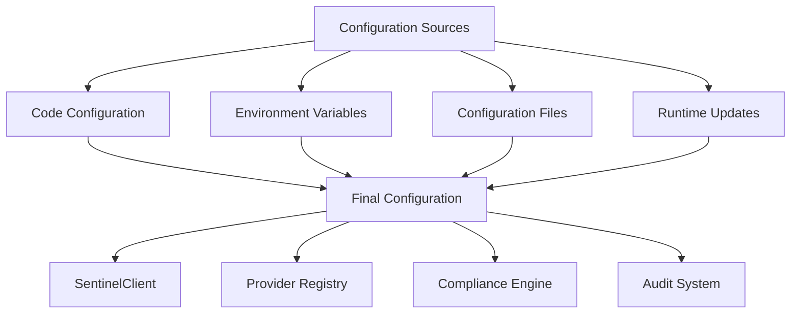

# Configuration

DeepSentinel provides a flexible configuration system that supports multiple configuration sources and layered overrides. This section explains how to configure the SDK for different environments and use cases.

## Configuration Architecture



## Configuration Sources

### 1. Code Configuration
Direct configuration through Python code:

```python
from deepsentinel import SentinelClient, SentinelConfig, CompliancePolicy

# Direct client configuration
client = SentinelClient(
    sentinel_api_key="your-key",
    openai_api_key="your-openai-key",
    debug_mode=True,
    max_risk_score=0.8
)

# Using configuration object
config = SentinelConfig(
    sentinel_api_key="your-key",
    default_provider="openai",
    debug_mode=True,
    compliance_policies=[
        CompliancePolicy(
            name="basic-policy",
            block_on_violation=True,
            max_risk_score=0.8
        )
    ]
)

client = SentinelClient(config=config)
```

### 2. Environment Variables
Configure through environment variables:

```bash
# Basic configuration
export DEEPSENTINEL_API_KEY="your-deepsentinel-key"
export OPENAI_API_KEY="your-openai-key"
export ANTHROPIC_API_KEY="your-anthropic-key"

# Advanced configuration
export DEEPSENTINEL_DEBUG_MODE="true"
export DEEPSENTINEL_MAX_RISK_SCORE="0.7"
export DEEPSENTINEL_DEFAULT_PROVIDER="openai"
export DEEPSENTINEL_ENVIRONMENT="production"

# Compliance configuration
export DEEPSENTINEL_BLOCK_ON_VIOLATION="true"
export DEEPSENTINEL_ENABLE_PII_DETECTION="true"
export DEEPSENTINEL_ENABLE_PHI_DETECTION="false"

# Performance configuration
export DEEPSENTINEL_REQUEST_TIMEOUT="30.0"
export DEEPSENTINEL_MAX_RETRIES="3"
export DEEPSENTINEL_CACHE_TTL="3600"
```

### 3. Configuration Files
Load configuration from YAML or JSON files:

**deepsentinel.yaml:**
```yaml
# Basic settings
sentinel_api_key: "your-deepsentinel-key"
default_provider: "openai"
debug_mode: true
environment: "production"

# Provider configurations
providers:
  openai:
    api_key: "your-openai-key"
    timeout: 30.0
    max_retries: 3
    base_url: "https://api.openai.com/v1"
  
  anthropic:
    api_key: "your-anthropic-key"
    timeout: 45.0
    max_retries: 2
    base_url: "https://api.anthropic.com"

# Compliance settings
compliance:
  block_on_violation: true
  max_risk_score: 0.8
  enable_pii_detection: true
  enable_phi_detection: false
  enable_pci_detection: true
  
  policies:
    - name: "gdpr-policy"
      jurisdictions: ["GDPR"]
      block_on_violation: true
      max_risk_score: 0.7
    
    - name: "hipaa-policy"
      jurisdictions: ["HIPAA"]
      enable_phi_detection: true
      block_on_violation: true

# Audit configuration
audit:
  enabled: true
  detailed_logs: true
  retention_days: 90
  
# Performance settings
performance:
  cache_enabled: true
  cache_ttl: 3600
  cache_max_size: 10000
  local_detection: true
  connection_pool_size: 10

# Logging configuration
logging:
  level: "INFO"
  structured: true
  include_request_body: false
  include_response_body: false
```

**Load from file:**
```python
from deepsentinel import SentinelConfig, SentinelClient

# Load from YAML
config = SentinelConfig.from_file("deepsentinel.yaml")
client = SentinelClient(config=config)

# Load from JSON
config = SentinelConfig.from_file("deepsentinel.json")
client = SentinelClient(config=config)
```

## Configuration Classes

### SentinelConfig
The main configuration class that holds all settings:

```python
from deepsentinel import SentinelConfig

config = SentinelConfig(
    # API credentials
    sentinel_api_key="your-key",
    
    # Provider settings
    default_provider="openai",
    provider_configs=[...],
    
    # Compliance settings
    compliance_policies=[...],
    max_risk_score=0.8,
    block_on_violation=True,
    
    # Performance settings
    request_timeout=30.0,
    max_retries=3,
    cache_enabled=True,
    
    # Environment settings
    environment="production",
    debug_mode=False,
    
    # Logging settings
    log_level="INFO"
)
```

### CompliancePolicy
Configuration for compliance rules and detection:

```python
from deepsentinel import CompliancePolicy

policy = CompliancePolicy(
    name="custom-policy",
    description="Custom compliance policy for our organization",
    
    # Jurisdictions to comply with
    jurisdictions=["GDPR", "HIPAA", "CCPA"],
    
    # Detection settings
    enable_pii_detection=True,
    enable_phi_detection=True,
    enable_pci_detection=True,
    
    # Risk assessment
    max_risk_score=0.8,
    block_threshold=0.7,
    anonymize_threshold=0.5,
    
    # Actions
    block_on_violation=True,
    anonymize_sensitive_data=False,
    log_violations=True,
    notify_on_violation=True,
    
    # Custom patterns
    custom_patterns={
        "employee_id": r"EMP\d{6}",
        "project_code": r"PROJ-[A-Z]{3}-\d{4}"
    }
)
```

### PIIPolicy
Specialized policy for PII detection:

```python
from deepsentinel import PIIPolicy

pii_policy = PIIPolicy(
    name="strict-pii",
    
    # PII types to detect
    pii_types=[
        "email_addresses",
        "phone_numbers",
        "social_security_numbers",
        "credit_card_numbers",
        "ip_addresses"
    ],
    
    # Handling strategy
    anonymization_strategy="mask",  # or "redact", "hash"
    block_threshold=0.7,
    anonymize_threshold=0.5,
    
    # Notifications
    notify_on_detection=True,
    notification_webhook="https://your-domain.com/pii-alerts"
)
```

### ProviderConfig
Configuration for individual LLM providers:

```python
from deepsentinel import ProviderConfig

openai_config = ProviderConfig(
    name="openai",
    api_key="your-openai-key",
    base_url="https://api.openai.com/v1",
    
    # Connection settings
    timeout=30.0,
    max_retries=3,
    
    # Rate limiting
    rate_limit={
        "requests_per_minute": 3500,
        "tokens_per_minute": 90000
    },
    
    # Model aliases
    model_aliases={
        "gpt-4-latest": "gpt-4o",
        "gpt-3.5": "gpt-3.5-turbo"
    },
    
    # Custom headers
    headers={
        "User-Agent": "MyApp/1.0",
        "X-Custom-Header": "value"
    }
)
```

## Configuration Validation

DeepSentinel automatically validates configuration and provides helpful error messages:

```python
from deepsentinel import SentinelConfig, ConfigurationError

try:
    config = SentinelConfig(
        sentinel_api_key="",  # Invalid: empty key
        max_risk_score=1.5,   # Invalid: score > 1.0
        request_timeout=-1    # Invalid: negative timeout
    )
except ConfigurationError as e:
    print(f"Configuration error: {e.message}")
    print(f"Invalid fields: {e.invalid_fields}")
```

## Environment-Specific Configuration

### Development Environment
```python
dev_config = SentinelConfig(
    environment="development",
    debug_mode=True,
    log_level="DEBUG",
    
    # Relaxed compliance for testing
    max_risk_score=0.9,
    block_on_violation=False,
    
    # Faster timeouts for development
    request_timeout=10.0,
    
    # Disable caching for fresh results
    cache_enabled=False
)
```

### Production Environment
```python
prod_config = SentinelConfig(
    environment="production",
    debug_mode=False,
    log_level="INFO",
    
    # Strict compliance
    max_risk_score=0.8,
    block_on_violation=True,
    
    # Production timeouts
    request_timeout=30.0,
    max_retries=3,
    
    # Enable all performance optimizations
    cache_enabled=True,
    local_detection=True,
    connection_pool_size=20,
    
    # Comprehensive audit logging
    audit_config=AuditConfig(
        enabled=True,
        detailed_logs=True,
        retention_days=365
    )
)
```

### Testing Environment
```python
test_config = SentinelConfig(
    environment="testing",
    debug_mode=True,
    
    # Use mock providers for testing
    provider_configs=[
        ProviderConfig(
            name="mock",
            base_url="http://localhost:8080/mock"
        )
    ],
    
    # Disable external calls
    api_integration_enabled=False,
    
    # Fast timeouts for tests
    request_timeout=5.0,
    
    # Deterministic behavior
    cache_enabled=False
)
```

## Dynamic Configuration

### Runtime Updates
Update configuration at runtime:

```python
client = SentinelClient(config=initial_config)

# Update compliance policy
new_policy = CompliancePolicy(
    name="stricter-policy",
    max_risk_score=0.6
)
client.config.add_compliance_policy(new_policy)

# Update provider configuration
client.config.add_provider(ProviderConfig(
    name="new_provider",
    api_key="new-key"
))

# Update performance settings
client.config.performance_config.cache_ttl = 7200
```

### Configuration Monitoring
Monitor configuration changes:

```python
@client.on_config_change
def handle_config_change(event):
    print(f"Configuration changed: {event.field} = {event.new_value}")
    
    # Re-initialize components if needed
    if event.field in ["compliance_policies", "provider_configs"]:
        client.reinitialize()
```

## Configuration Best Practices

### 1. Use Environment-Specific Configs
Create separate configuration files for each environment:

```
configs/
├── development.yaml
├── staging.yaml
├── production.yaml
└── testing.yaml
```

### 2. Secure API Keys
Never hardcode API keys in configuration files:

```python
# Good: Use environment variables
config = SentinelConfig(
    sentinel_api_key=os.getenv("DEEPSENTINEL_API_KEY"),
    openai_api_key=os.getenv("OPENAI_API_KEY")
)

# Better: Use secret management
from your_secrets import get_secret

config = SentinelConfig(
    sentinel_api_key=get_secret("deepsentinel-api-key"),
    openai_api_key=get_secret("openai-api-key")
)
```

### 3. Layer Configuration Sources
Use multiple configuration sources with proper precedence:

```python
# 1. Start with file configuration
config = SentinelConfig.from_file("config.yaml")

# 2. Override with environment variables
config.update_from_env()

# 3. Apply runtime overrides
config.update_from_dict({
    "debug_mode": True,
    "log_level": "DEBUG"
})
```

### 4. Validate Configuration Early
Validate configuration at startup:

```python
def validate_config(config: SentinelConfig) -> None:
    """Validate configuration before using it."""
    if not config.sentinel_api_key:
        raise ConfigurationError("DeepSentinel API key is required")
    
    if not any(p.api_key for p in config.provider_configs):
        raise ConfigurationError("At least one provider API key is required")
    
    if config.max_risk_score < 0 or config.max_risk_score > 1:
        raise ConfigurationError("max_risk_score must be between 0 and 1")

# Validate before creating client
validate_config(config)
client = SentinelClient(config=config)
```

### 5. Use Configuration Templates
Create reusable configuration templates:

```python
def create_gdpr_config(**overrides) -> SentinelConfig:
    """Create GDPR-compliant configuration."""
    base_config = {
        "compliance_policies": [
            CompliancePolicy(
                name="gdpr-policy",
                jurisdictions=["GDPR"],
                block_on_violation=True,
                max_risk_score=0.7,
                enable_pii_detection=True
            )
        ],
        "audit_config": AuditConfig(
            enabled=True,
            retention_days=365,
            detailed_logs=True
        )
    }
    
    base_config.update(overrides)
    return SentinelConfig(**base_config)

# Use the template
config = create_gdpr_config(
    sentinel_api_key="your-key",
    openai_api_key="your-openai-key"
)
```

## Configuration Reference

### Complete Configuration Example
```python
from deepsentinel import (
    SentinelConfig, CompliancePolicy, PIIPolicy, 
    ProviderConfig, AuditConfig, LoggingConfig, PerformanceConfig
)

config = SentinelConfig(
    # API credentials
    sentinel_api_key="your-deepsentinel-key",
    
    # Environment
    environment="production",
    debug_mode=False,
    
    # Provider settings
    default_provider="openai",
    provider_configs=[
        ProviderConfig(
            name="openai",
            api_key="your-openai-key",
            timeout=30.0,
            max_retries=3
        ),
        ProviderConfig(
            name="anthropic",
            api_key="your-anthropic-key",
            timeout=45.0,
            max_retries=2
        )
    ],
    
    # Compliance policies
    compliance_policies=[
        CompliancePolicy(
            name="base-policy",
            jurisdictions=["GDPR", "CCPA"],
            block_on_violation=True,
            max_risk_score=0.8,
            enable_pii_detection=True,
            enable_phi_detection=False,
            enable_pci_detection=True
        ),
        PIIPolicy(
            name="pii-policy",
            pii_types=["email", "phone", "ssn"],
            anonymization_strategy="mask",
            block_threshold=0.7
        )
    ],
    
    # Audit configuration
    audit_config=AuditConfig(
        enabled=True,
        detailed_logs=True,
        retention_days=90,
        export_format="json"
    ),
    
    # Logging configuration
    logging_config=LoggingConfig(
        level="INFO",
        structured=True,
        include_request_body=False,
        include_response_body=False
    ),
    
    # Performance configuration
    performance_config=PerformanceConfig(
        cache_enabled=True,
        cache_ttl=3600,
        cache_max_size=10000,
        local_detection=True,
        connection_pool_size=10,
        request_timeout=30.0,
        max_retries=3
    )
)
```

---

**Next**: [Tutorials →](../tutorials/index.md)