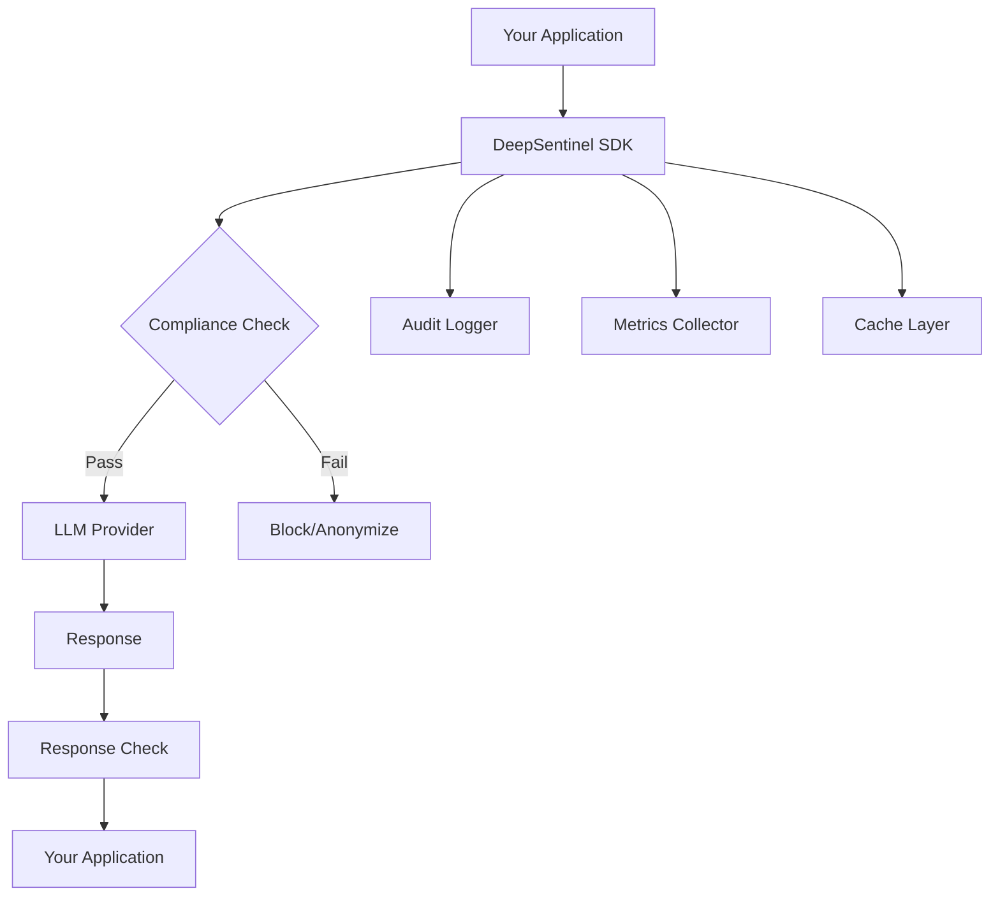

# Core Concepts

Understanding how DeepSentinel works will help you make the most of its compliance and security features. This section covers the fundamental concepts and architecture.

## Overview

DeepSentinel is designed around a simple principle: **intercept, analyze, and protect**. It sits between your application and LLM providers, ensuring that sensitive data never leaves your control without proper checks.

## Key Components

### 1. [Overview](overview.md)
Learn how DeepSentinel works as middleware and understand the request/response flow.

### 2. [Compliance & Security](compliance.md)
Understand the compliance engine, detection capabilities, and security features.

### 3. [Provider Integration](providers.md)
Learn how DeepSentinel integrates with different LLM providers while maintaining a consistent interface.

### 4. [Configuration](configuration.md)
Master the configuration system to customize DeepSentinel for your specific needs.

## Design Principles

### Simple Integration
DeepSentinel is designed to be a drop-in replacement for direct LLM provider SDKs. If you're using OpenAI's SDK, you can switch to DeepSentinel with minimal code changes.

### Compliance First
Every request is analyzed for compliance violations before reaching the LLM provider. This ensures that sensitive data is protected at the source.

### Performance Focused
Local detection and intelligent caching minimize latency impact. Most compliance checks add less than 5ms to request processing time.

### Provider Agnostic
The same interface works across all supported LLM providers, making it easy to switch providers or use multiple providers in the same application.

### Observable
Comprehensive logging and metrics provide visibility into compliance events, performance, and system health.

## Getting Started

If you haven't already, start with the [Quick Start Guide](../quickstart.md) to get DeepSentinel running in your application.

Then dive into each concept section to understand how to configure and optimize DeepSentinel for your specific use case.

---

**Next**: [Overview →](overview.md)