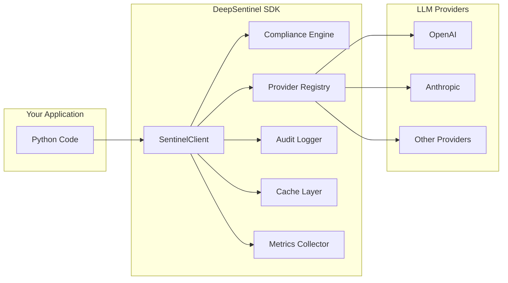

# Overview - How DeepSentinel Works

DeepSentinel acts as an intelligent middleware layer between your application and LLM providers. It intercepts requests, applies compliance checks, and ensures sensitive data is handled safely.

## Architecture Overview



## Request Flow

Understanding the request flow helps you see where compliance checks happen and how to optimize performance:

### 1. Request Initiation
```python
response = client.chat.completions.create(
    model="gpt-4o",
    messages=[{"role": "user", "content": "Hello, world!"}]
)
```

### 2. Pre-Processing
- **Local Detection**: Fast, on-device scanning for obvious sensitive data patterns
- **Request Validation**: Ensures the request format is correct
- **Cache Check**: Looks for previous compliance decisions for similar requests

### 3. Compliance Analysis
- **PII Detection**: Scans for personally identifiable information
- **PHI Detection**: Checks for protected health information
- **PCI Detection**: Looks for payment card information
- **Policy Evaluation**: Applies your organization's compliance policies

### 4. Decision Making
Based on the compliance analysis, DeepSentinel will:

- **✅ Allow**: Request passes all checks and proceeds to the provider
- **🚫 Block**: Request contains sensitive data and is rejected
- **🔄 Anonymize**: Sensitive data is masked before sending to the provider

### 5. Provider Communication
- **Provider Selection**: Routes to the appropriate LLM provider
- **Request Transformation**: Adapts the request format for the specific provider
- **Error Handling**: Manages provider-specific errors and retries

### 6. Response Processing
- **Response Validation**: Ensures the response format is correct
- **Compliance Check**: Scans response content for any leaked sensitive data
- **Audit Logging**: Records the interaction for compliance tracking

### 7. Response Delivery
The processed response is returned to your application with the same interface you'd expect from the provider's SDK.

## Core Components

### SentinelClient

The main entry point for all interactions. It provides interfaces that match popular LLM provider SDKs:

```python
from deepsentinel import SentinelClient

client = SentinelClient(
    sentinel_api_key="your-key",
    openai_api_key="your-openai-key"
)

# Chat interface (like OpenAI)
client.chat.completions.create(...)

# Embeddings interface
client.embeddings.create(...)

# Models interface
client.models.list()
```

### Compliance Engine

The heart of DeepSentinel's security features:

- **Detection Engines**: Specialized modules for different types of sensitive data
- **Policy Manager**: Enforces your organization's compliance rules
- **Risk Assessment**: Calculates risk scores for content
- **Action Enforcement**: Blocks, allows, or anonymizes based on policies

### Provider Registry

Manages connections to different LLM providers:

- **Provider Adapters**: Translates between DeepSentinel's interface and provider APIs
- **Load Balancing**: Distributes requests across multiple providers
- **Health Monitoring**: Tracks provider availability and performance
- **Fallback Handling**: Switches providers when one becomes unavailable

### Audit System

Comprehensive logging for compliance and monitoring:

- **Request Logging**: Records all incoming requests and their compliance status
- **Response Logging**: Tracks all responses and any transformations
- **Event Streaming**: Real-time events for monitoring systems
- **Retention Management**: Automatically manages log retention based on policies

## Interfaces

DeepSentinel provides familiar interfaces that match popular LLM provider SDKs:

### Chat Interface
```python
# Synchronous
response = client.chat.completions.create(
    model="gpt-4o",
    messages=[{"role": "user", "content": "Hello!"}]
)

# Streaming
for chunk in client.chat.completions.create(
    model="gpt-4o",
    messages=[{"role": "user", "content": "Hello!"}],
    stream=True
):
    print(chunk.choices[0].delta.content, end="")
```

### Embeddings Interface
```python
response = client.embeddings.create(
    model="text-embedding-ada-002",
    input="Text to embed"
)
```

### Models Interface
```python
# List available models
models = client.models.list()

# Get model details
model = client.models.retrieve("gpt-4o")
```

## Configuration Layers

DeepSentinel supports multiple configuration layers for flexibility:

### 1. Code Configuration
```python
from deepsentinel import SentinelClient, CompliancePolicy

policy = CompliancePolicy(
    name="strict-policy",
    block_on_violation=True,
    max_risk_score=0.7
)

client = SentinelClient(
    sentinel_api_key="your-key",
    compliance_policies=[policy]
)
```

### 2. Environment Variables
```bash
export DEEPSENTINEL_API_KEY="your-key"
export DEEPSENTINEL_DEBUG_MODE="true"
export DEEPSENTINEL_MAX_RISK_SCORE="0.7"
```

### 3. Configuration Files
```python
from deepsentinel import SentinelConfig

config = SentinelConfig.from_file("deepsentinel.yaml")
client = SentinelClient(config=config)
```

## Performance Characteristics

### Latency Impact
- **Local Detection**: < 5ms for most requests
- **Cloud Compliance**: 50-200ms depending on content complexity
- **Caching**: Near-zero latency for repeated patterns

### Throughput
- **Concurrent Requests**: Handles thousands of concurrent requests
- **Provider Limits**: Respects and manages provider rate limits
- **Connection Pooling**: Efficient connection reuse

### Memory Usage
- **Minimal Footprint**: ~50MB base memory usage
- **Efficient Caching**: Configurable cache size limits
- **Streaming Support**: Constant memory usage for streaming responses

## Error Handling

DeepSentinel provides comprehensive error handling:

```python
from deepsentinel import (
    ComplianceViolationError,
    ProviderError,
    ConfigurationError
)

try:
    response = client.chat.completions.create(...)
except ComplianceViolationError as e:
    # Handle compliance violations
    print(f"Sensitive data detected: {e.violations}")
except ProviderError as e:
    # Handle provider issues
    print(f"Provider error: {e.provider}, {e.message}")
except ConfigurationError as e:
    # Handle configuration problems
    print(f"Configuration issue: {e.message}")
```

## Monitoring and Observability

DeepSentinel provides rich monitoring capabilities:

### Health Checks
```python
health = await client.health_check()
print(f"Status: {health['status']}")
print(f"Providers: {health['providers']}")
```

### Metrics Collection
```python
from deepsentinel import MetricsCollector

metrics = client.metrics_collector
print(f"Total requests: {metrics.total_requests}")
print(f"Compliance violations: {metrics.compliance_violations}")
print(f"Average latency: {metrics.average_latency}ms")
```

### Audit Events
```python
from deepsentinel import AuditAPI

audit = AuditAPI(client)
events = await audit.get_recent_events(limit=10)
for event in events:
    print(f"{event.timestamp}: {event.event_type} - {event.message}")
```

## Next Steps

Now that you understand how DeepSentinel works, dive deeper into specific concepts:

- **[Compliance & Security](compliance.md)** - Learn about detection capabilities and policies
- **[Provider Integration](providers.md)** - Understand how provider adapters work
- **[Configuration](configuration.md)** - Master the configuration system

---

**Next**: [Compliance & Security →](compliance.md)