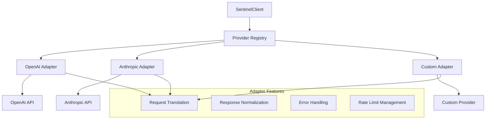

# Provider Integration

DeepSentinel provides a unified interface for multiple LLM providers while maintaining compatibility with their native SDKs. This section explains how provider adapters work and how to configure multiple providers.

## Provider Architecture



## Supported Providers

### OpenAI
Full support for OpenAI's API with all model types:

```python
from deepsentinel import SentinelClient

client = SentinelClient(
    sentinel_api_key="your-key",
    openai_api_key="your-openai-key"
)

# Chat completions
response = client.chat.completions.create(
    model="gpt-4o",
    messages=[{"role": "user", "content": "Hello!"}]
)

# Embeddings
embeddings = client.embeddings.create(
    model="text-embedding-ada-002",
    input="Text to embed"
)

# Image generation
image = client.images.generate(
    prompt="A sunset over mountains",
    model="dall-e-3"
)
```

### Anthropic
Complete Claude model support:

```python
client = SentinelClient(
    sentinel_api_key="your-key",
    anthropic_api_key="your-anthropic-key"
)

# Use Claude with the same interface
response = client.chat.completions.create(
    model="claude-3-opus-20240229",
    messages=[{"role": "user", "content": "Hello!"}],
    provider="anthropic"  # Specify provider
)
```

### Multiple Providers
Use multiple providers in the same application:

```python
client = SentinelClient(
    sentinel_api_key="your-key",
    openai_api_key="your-openai-key",
    anthropic_api_key="your-anthropic-key"
)

# Default provider (OpenAI)
openai_response = client.chat.completions.create(
    model="gpt-4o",
    messages=[{"role": "user", "content": "Hello from OpenAI!"}]
)

# Explicit provider selection
anthropic_response = client.chat.completions.create(
    model="claude-3-opus-20240229",
    messages=[{"role": "user", "content": "Hello from Anthropic!"}],
    provider="anthropic"
)
```

## Provider Adapters

### How Adapters Work

Each provider adapter handles the translation between DeepSentinel's unified interface and the provider's specific API:

```python
# DeepSentinel unified interface
request = ChatRequest(
    model="gpt-4o",
    messages=[{"role": "user", "content": "Hello!"}],
    temperature=0.7,
    max_tokens=100
)

# OpenAI adapter translates to:
openai_request = {
    "model": "gpt-4o",
    "messages": [{"role": "user", "content": "Hello!"}],
    "temperature": 0.7,
    "max_tokens": 100
}

# Anthropic adapter translates to:
anthropic_request = {
    "model": "claude-3-opus-20240229",
    "messages": [{"role": "user", "content": "Hello!"}],
    "temperature": 0.7,
    "max_tokens": 100
}
```

### Custom Adapters

Create your own adapter for unsupported providers:

```python
from deepsentinel import BaseLLMProvider, ProviderAdapter

class CustomProvider(BaseLLMProvider):
    """Custom provider adapter."""
    
    def __init__(self, api_key: str, base_url: str = None):
        self.api_key = api_key
        self.base_url = base_url or "https://api.custom-provider.com"
        
    async def chat_completion(self, request: ChatRequest, **kwargs) -> ChatResponse:
        """Implement chat completion for your provider."""
        # Transform request to provider format
        provider_request = self._transform_request(request)
        
        # Make API call
        async with httpx.AsyncClient() as client:
            response = await client.post(
                f"{self.base_url}/v1/chat/completions",
                headers={"Authorization": f"Bearer {self.api_key}"},
                json=provider_request
            )
        
        # Transform response to DeepSentinel format
        return self._transform_response(response.json())
    
    def _transform_request(self, request: ChatRequest) -> dict:
        """Transform DeepSentinel request to provider format."""
        return {
            "model": request.model,
            "messages": [msg.dict() for msg in request.messages],
            "temperature": request.temperature,
            # ... other transformations
        }
    
    def _transform_response(self, provider_response: dict) -> ChatResponse:
        """Transform provider response to DeepSentinel format."""
        return ChatResponse(
            id=provider_response["id"],
            choices=[
                Choice(
                    index=choice["index"],
                    message=Message(
                        role=choice["message"]["role"],
                        content=choice["message"]["content"]
                    ),
                    finish_reason=choice["finish_reason"]
                )
                for choice in provider_response["choices"]
            ],
            usage=Usage(
                prompt_tokens=provider_response["usage"]["prompt_tokens"],
                completion_tokens=provider_response["usage"]["completion_tokens"],
                total_tokens=provider_response["usage"]["total_tokens"]
            )
        )

# Register the custom provider
client.provider_registry.register("custom", CustomProvider(api_key="your-key"))

# Use the custom provider
response = client.chat.completions.create(
    model="custom-model",
    messages=[{"role": "user", "content": "Hello!"}],
    provider="custom"
)
```

## Provider Configuration

### Basic Configuration
```python
from deepsentinel import SentinelClient, ProviderConfig

# Individual provider configs
openai_config = ProviderConfig(
    name="openai",
    api_key="your-openai-key",
    base_url="https://api.openai.com/v1",
    timeout=30.0,
    max_retries=3
)

anthropic_config = ProviderConfig(
    name="anthropic", 
    api_key="your-anthropic-key",
    base_url="https://api.anthropic.com",
    timeout=30.0,
    max_retries=3
)

client = SentinelClient(
    sentinel_api_key="your-key",
    provider_configs=[openai_config, anthropic_config]
)
```

### Advanced Configuration
```python
from deepsentinel import SentinelConfig, ProviderConfig

config = SentinelConfig(
    sentinel_api_key="your-key",
    default_provider="openai",
    provider_configs=[
        ProviderConfig(
            name="openai",
            api_key="your-openai-key",
            timeout=30.0,
            max_retries=3,
            rate_limit={
                "requests_per_minute": 3500,
                "tokens_per_minute": 90000
            },
            model_aliases={
                "gpt-4-latest": "gpt-4o",
                "gpt-3.5": "gpt-3.5-turbo"
            }
        ),
        ProviderConfig(
            name="anthropic",
            api_key="your-anthropic-key", 
            timeout=45.0,
            max_retries=2,
            rate_limit={
                "requests_per_minute": 1000,
                "tokens_per_minute": 40000
            }
        )
    ]
)

client = SentinelClient(config=config)
```

## Provider Selection Strategies

### Manual Selection
Explicitly choose the provider for each request:

```python
# Use OpenAI
openai_response = client.chat.completions.create(
    model="gpt-4o",
    messages=[{"role": "user", "content": "Hello!"}],
    provider="openai"
)

# Use Anthropic
anthropic_response = client.chat.completions.create(
    model="claude-3-opus-20240229", 
    messages=[{"role": "user", "content": "Hello!"}],
    provider="anthropic"
)
```

### Automatic Provider Selection
Let DeepSentinel choose based on model availability:

```python
# DeepSentinel automatically selects the provider based on the model
response = client.chat.completions.create(
    model="gpt-4o",  # Automatically routes to OpenAI
    messages=[{"role": "user", "content": "Hello!"}]
)

response = client.chat.completions.create(
    model="claude-3-opus-20240229",  # Automatically routes to Anthropic
    messages=[{"role": "user", "content": "Hello!"}]
)
```

### Load Balancing
Distribute requests across multiple providers:

```python
from deepsentinel import LoadBalancingStrategy

config = SentinelConfig(
    load_balancing=LoadBalancingStrategy(
        strategy="round_robin",  # or "weighted", "least_latency"
        providers=["openai", "anthropic"],
        weights={"openai": 0.7, "anthropic": 0.3}  # For weighted strategy
    )
)
```

### Fallback Strategy
Automatically fallback to secondary providers:

```python
config = SentinelConfig(
    fallback_strategy={
        "primary": "openai",
        "fallbacks": ["anthropic", "custom"],
        "retry_attempts": 2,
        "fallback_conditions": ["rate_limit", "timeout", "server_error"]
    }
)
```

## Model Mapping

### Cross-Provider Model Mapping
Map equivalent models across providers:

```python
model_mapping = {
    "gpt-4": {
        "openai": "gpt-4o",
        "anthropic": "claude-3-opus-20240229"
    },
    "gpt-3.5": {
        "openai": "gpt-3.5-turbo",
        "anthropic": "claude-3-haiku-20240307"
    }
}

# Use the same model name, different providers
response1 = client.chat.completions.create(
    model="gpt-4",
    messages=[{"role": "user", "content": "Hello!"}],
    provider="openai"  # Uses gpt-4o
)

response2 = client.chat.completions.create(
    model="gpt-4", 
    messages=[{"role": "user", "content": "Hello!"}],
    provider="anthropic"  # Uses claude-3-opus-20240229
)
```

## Provider-Specific Features

### OpenAI-Specific Features
```python
# Function calling
response = client.chat.completions.create(
    model="gpt-4o",
    messages=[{"role": "user", "content": "What's the weather?"}],
    tools=[{
        "type": "function",
        "function": {
            "name": "get_weather",
            "description": "Get weather information",
            "parameters": {
                "type": "object",
                "properties": {
                    "location": {"type": "string"}
                }
            }
        }
    }],
    tool_choice="auto"
)

# Image generation
image = client.images.generate(
    prompt="A futuristic city",
    model="dall-e-3",
    size="1024x1024",
    quality="hd"
)
```

### Anthropic-Specific Features
```python
# System messages handling
response = client.chat.completions.create(
    model="claude-3-opus-20240229",
    messages=[
        {"role": "system", "content": "You are a helpful assistant."},
        {"role": "user", "content": "Hello!"}
    ],
    provider="anthropic"
)

# Anthropic's max_tokens requirement
response = client.chat.completions.create(
    model="claude-3-opus-20240229",
    messages=[{"role": "user", "content": "Write a story"}],
    max_tokens=1000,  # Required for Anthropic
    provider="anthropic"
)
```

## Error Handling

### Provider-Specific Errors
```python
from deepsentinel import ProviderError, AuthenticationError, RateLimitError

try:
    response = client.chat.completions.create(
        model="gpt-4o",
        messages=[{"role": "user", "content": "Hello!"}]
    )
except AuthenticationError as e:
    print(f"Authentication failed for provider {e.provider}: {e.message}")
except RateLimitError as e:
    print(f"Rate limit exceeded for provider {e.provider}")
    print(f"Retry after: {e.retry_after} seconds")
except ProviderError as e:
    print(f"Provider {e.provider} error: {e.message}")
```

### Automatic Error Recovery
```python
config = SentinelConfig(
    error_recovery={
        "auto_retry": True,
        "max_retries": 3,
        "backoff_strategy": "exponential",
        "retry_on": ["timeout", "server_error", "rate_limit"],
        "fallback_provider": True
    }
)
```

## Performance Monitoring

### Provider Performance Metrics
```python
# Get performance metrics for each provider
metrics = client.metrics_collector.get_provider_metrics()

for provider_name, metrics in metrics.items():
    print(f"Provider: {provider_name}")
    print(f"  Average latency: {metrics.avg_latency}ms")
    print(f"  Success rate: {metrics.success_rate}%")
    print(f"  Total requests: {metrics.total_requests}")
    print(f"  Error rate: {metrics.error_rate}%")
```

### Health Monitoring
```python
# Check provider health
health = await client.health_check()

for provider, status in health["providers"].items():
    print(f"{provider}: {status['status']}")
    if status['status'] == 'unhealthy':
        print(f"  Error: {status['error']}")
        print(f"  Last check: {status['last_check']}")
```

## Best Practices

### 1. Provider Diversity
Use multiple providers for resilience:

```python
# Configure multiple providers for redundancy
config = SentinelConfig(
    provider_configs=[
        ProviderConfig(name="openai", api_key="..."),
        ProviderConfig(name="anthropic", api_key="..."),
        ProviderConfig(name="custom", api_key="...")
    ],
    fallback_strategy={"primary": "openai", "fallbacks": ["anthropic", "custom"]}
)
```

### 2. Cost Optimization
Choose providers based on cost and performance requirements:

```python
# Use cheaper providers for simple tasks
simple_tasks_config = {
    "model_routing": {
        "simple_qa": {"provider": "openai", "model": "gpt-3.5-turbo"},
        "complex_reasoning": {"provider": "anthropic", "model": "claude-3-opus"},
        "code_generation": {"provider": "openai", "model": "gpt-4o"}
    }
}
```

### 3. Rate Limit Management
Respect provider rate limits:

```python
config = SentinelConfig(
    rate_limiting={
        "enabled": True,
        "per_provider": True,
        "buffer_percentage": 0.1,  # Use 90% of limit
        "queue_requests": True
    }
)
```

### 4. Model Selection
Choose appropriate models for different use cases:

```python
model_selection = {
    "chat": "gpt-4o",              # Best for conversations
    "code": "gpt-4o",              # Best for coding
    "analysis": "claude-3-opus",    # Best for analysis
    "creative": "claude-3-opus",    # Best for creative tasks
    "embeddings": "text-embedding-ada-002"  # For embeddings
}
```

---

**Next**: [Configuration →](configuration.md)