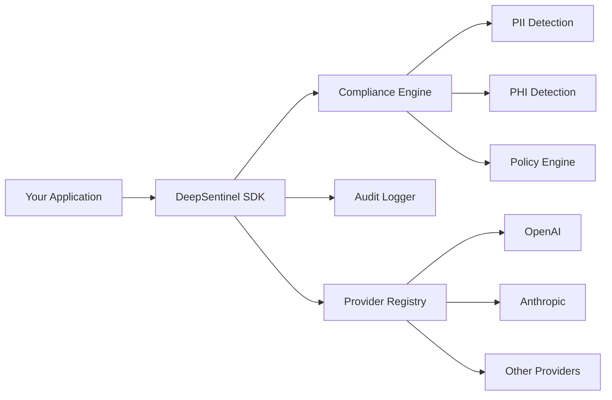

# DeepSentinel Python SDK

**AI compliance middleware for safe LLM interactions**

DeepSentinel sits between your application and LLM providers like OpenAI and Anthropic, automatically checking for sensitive data and ensuring compliance with regulations like GDPR, HIPAA, and CCPA.

## Key Features

🛡️ **Compliance Checking** - Automatic detection of PII, PHI, and regulatory violations  
🔄 **Multiple Providers** - Support for OpenAI, Anthropic, and other LLM providers  
📊 **Audit Logging** - Comprehensive activity logging for compliance tracking  
⚡ **Performance** - Local detection with smart caching for minimal latency  
🔌 **MCP Support** - Integration with Model Context Protocol for advanced features  
🌐 **Streaming** - Full support for streaming responses with compliance checks  

## Quick Start

Install DeepSentinel:

```bash
pip install deepsentinel-sdk```

Use it just like you would use OpenAI's SDK:

```python
from deepsentinel import SentinelClient

# Initialize the client
client = SentinelClient(
    sentinel_api_key="your-deepsentinel-api-key",
    openai_api_key="your-openai-api-key"
)

# Send a compliant request
response = client.chat.completions.create(
    model="gpt-4o",
    messages=[{"role": "user", "content": "Hello, world!"}]
)

print(response.choices[0].message.content)
```

That's it! DeepSentinel automatically:
- Scans your requests for sensitive data
- Ensures compliance with your configured policies
- Logs all interactions for audit purposes
- Routes requests to your chosen LLM provider

## Why DeepSentinel?

### Before: Direct API Usage
```python
import openai

# No compliance checking
# No audit logging
# Manual security implementation
# Multiple provider integrations
client = openai.OpenAI(api_key="sk-...")
response = client.chat.completions.create(...)
```

### After: With DeepSentinel
```python
from deepsentinel import SentinelClient

# Automatic compliance checking ✓
# Built-in audit logging ✓
# Enterprise security ✓
# Unified provider interface ✓
client = SentinelClient(
    sentinel_api_key="ds-...",
    openai_api_key="sk-..."
)
response = client.chat.completions.create(...)
```

## Architecture Overview



DeepSentinel acts as an intelligent middleware layer that:

1. **Intercepts** all requests before they reach LLM providers
2. **Analyzes** content for sensitive data and compliance violations
3. **Enforces** your organization's compliance policies
4. **Logs** all interactions for audit and monitoring
5. **Routes** approved requests to the appropriate provider

## What's Next?

- **[Quick Start Guide](quickstart.md)** - Get up and running in 5 minutes
- **[Core Concepts](concepts/overview.md)** - Understand how DeepSentinel works
- **[API Reference](reference/)** - Complete API documentation
- **[Tutorials](tutorials/)** - Step-by-step guides for common use cases

## Requirements

- Python 3.8+
- API key from DeepSentinel ([sign up here](https://deepsentinel.ai/signup))
- API keys from supported LLM providers (OpenAI, Anthropic, etc.)

## Support

- **Documentation**: [https://deepsentinel-ai.github.io/deepsentinel-python](https://deepsentinel-ai.github.io/deepsentinel-python)
- **GitHub**: [https://github.com/deepsentinel/deepsentinel-sdk](https://github.com/deepsentinel/deepsentinel-sdk)
- **Support**: [support@deepsentinel.ai](mailto:support@deepsentinel.ai)
- **Community**: [Discord](https://discord.gg/deepsentinel)

---

Ready to secure your AI applications? [Get started now →](quickstart.md)